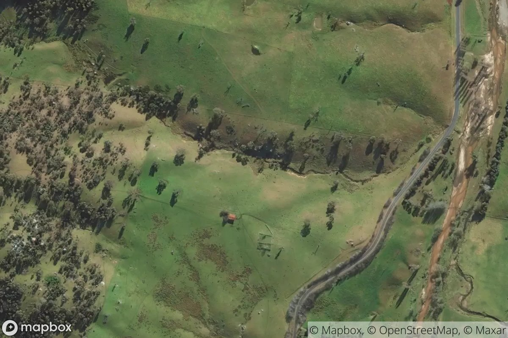

# canberramapbot


Randomly post bird's-eye views over Canberra (roughly a rectangle) at a random success rate.

A clone from Matt Dray's [londonmapbot](https://github.com/matt-dray/londonmapbot). Twitter: [@londonmapbot](https://twitter.com/londonmapbot)



## Procedure

```
GitHub Action --(cron)--> Mapbox --(rtweet)--> Twitter
```

## Issues

- [ ] Sometimes the GitHub Action fails with exit code 1. Not sure why.

## Reference

- [Quick GitHub Actions for your R package](https://www.rostrum.blog/2020/08/09/ghactions-pkgs/)
- [A Twitter bot with {rtweet} and GitHub Actions](https://www.rostrum.blog/2020/09/21/londonmapbot/)
- [Crontab.guru](https://crontab.guru/), the cron schedule expression editor.
